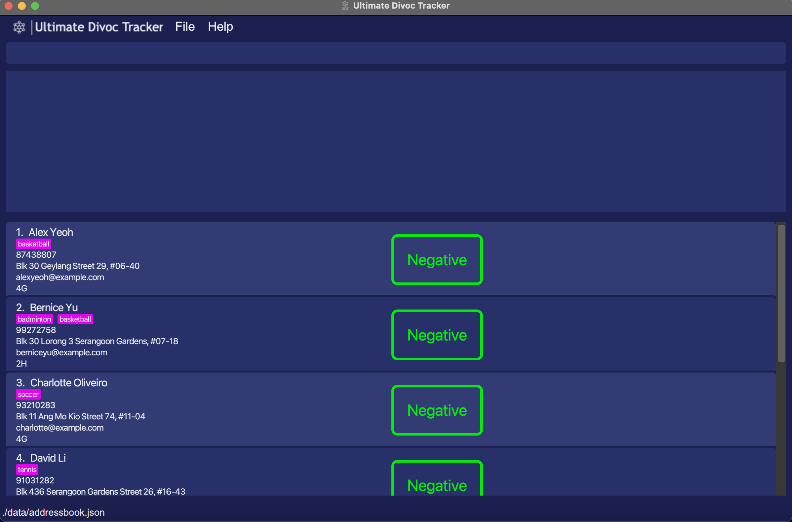
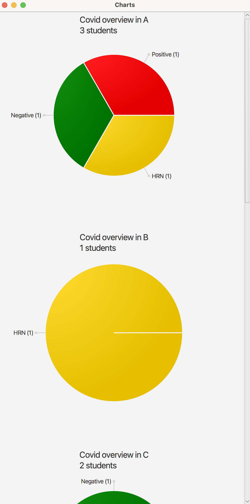

# Tracey

Tracey is a **desktop app for managing health statuses of NUS Hall Residents, optimized for use via a Command Line
Interface** (CLI) while still having the benefits of a Graphical User Interface (GUI). If you can type fast,
Tracey can get your student health status management tasks done faster than traditional GUI apps.

--------------------------------------------------------------------------------------------------------------------

* [Quick Start](#quick-start)
* [Features](#features)
    * [Finding a contact](#finding-a-contact-find)
    * [Adding a contact](#adding-a-contact-add)
    * [Deleting a contact](#deleting-a-contact-delete)
    * [Editing an exisiting contact](#editing-an-existing-contact-edit)
    * [Clearing all records](#clearing-all-records-clear)
    * [Summarising the records](#summarising-the-records-summarise)
    * [Listing the records](#listing-the-records-list)
    * [Viewing help](#viewing-help-help)
    * [Filtering contacts](#filtering-contacts-filter)
    * [Archiving address book](#archiving-address-book-archive)
    * [Saving](#saving)
    * [Copying Emails](#copying-emails)
* [FAQ](#faq)
* [Command Summary](#command-summary)

--------------------------------------------------------------------------------------------------------------------

## Quick Start
1. Ensure you have Java 11 or above installed in your Computer.
2. Download the latest `Tracey.jar` from [here](https://github.com/se-edu/addressbook-level3/releases).
3. Copy the file to the folder you want to use as the home folder for your Tracey application.
4. Double-click the file to start the app. The GUI similar to the below should appear in a few seconds.
   Note how the app contains some sample data.  
   
5. Type the command in the command box and press Enter to execute it. e.g. typing **`help`** and pressing Enter will open the help window. 
   Some example commands you can try:

* **`list`** : Lists all contacts.

* **`summarise`** : summarise all contacts into their respective faculty and informs the reader percentage of student from that faculty is Covid positive.

* **`add`**`n/John Doe p/98765432 e/johnd@example.com a/John street, block 123, #01-01` : Adds a contact named `John Doe` to the Address Book.

* **`delete`**`3` : Deletes the 3rd contact shown in the current list.

* **`clear`** : Deletes all contacts.

* **`exit`** : Exits the app.

6. Refer to the [Features](#features) below for details of each command.

--------------------------------------------------------------------------------------------------------------------

## Features
### Finding a contact: `find`
Find a particular contact in Tracey and retrieve their specific details.

Format: `find NAME`
* Returns the student(s) with their student specific **details**.
* The **details** provided are the student's `Name`, `Matriculation Number`, `Faculty`, `Block`, `Phone`, `Address`, `Email` amd `Covid Status`.
* A screenshot (Figure 1) is provided below to demonstrate what the find function returns to the user.
* The search is case-insensitive. e.g `johnDoe` will match `Johndoe`
* The search does not require full name. e.g. `jo` will match `Joe` and `John`

Examples of usages:

* `find John` returns `john` and `John Doe`
* `find alex david` returns `Alex Yeoh` and`David Li`
* `find J` returns `john` and`jay`

Scenario:
 *Figure 1: Screenshot of result of the find command*

As seen in the *figure 1*, after the user keys in `find Bernice`, the application returns Bernice's details: `Name`, `Matriculation Number`, `Faculty`, `Block`, `Phone`, `Address`, `Email` amd `Covid Status`.

### Adding a contact: `add`
Add a student with relevant details into Tracey.

Format: `add n/NAME p/PHONENUMBER e/EMAIL ...`
* Add a student with the specific tags
* The student name is case-sensitive e.g. `add n/johnDoe` will be logged as `johnDoe` and not `JohnDoe` in Tracey
* Phone Number, email and matriculation number must be **unique** to each student
* Order of the tags does not matter e.g. `add n/NAME p/PHONENUMBER` is the same as `add p/PHONENUMBER n/NAME`
* Tracey will acknowledge that the student has been added
* Tags for faculty and covid status need to be specific to the list defined below (refer to Pre-defined constants).
* If the inputted tag is not one of those defined in the **Pre-defined constants** as described in Figure 3, there will be an error and the user will have to input the details again.

| Correct Usage :white_check_mark: | Incorrect Usage  :x: |
|:--------------------:|:-----------------:|
|     cs/Negative      | cs/Close-contact  |  
|        f/SoC         |      f/SooC       |  
*Figure 2 highlights the importance of sticking to the **Pre-defined constants** as listed in figure 3.*

Examples of usage:
* `add n/Melvin f/SOC cs/ Negative`
* `add e/student69@u.nus.edu n/ Martin`

| **Tag** | **Meaning** |                                                 **Pre-defined constants**                                                  |
|:-------:|:-----------:|:--------------------------------------------------------------------------------------------------------------------------:|
|    `n/`     |       Name        |                                                                                                                            |
|    `p/`     |      Phone Number       |                                                                                                                            |
|    `e/`     |       Email        |                                                                                                                            |
|    `a/`     |       Address       |                                                                                                                            |
|    `f/`     |      Faculty       |             `FASS` `BIZ` `SOC` `SCALE` `FOD` `CDE` `DUKE` `FOL` `YLLSOM` `YSTCOM` `SOPP` `LKYSPP` `SPH` `FOS`              |
|    `mc/`     |      Matriculation Number       |                                                                                                                            |
|    `cs/`     |      Covid Status       |                                               `Positive`, `Negative`, `HRN`                                                |
*Figure 3: Table showing list of possible tags and the Pre-defined constants*

As described in Figure 3, these are the possible tags that can be used with **Tracey**. E.g `n/`, `cs/` etc.
In addition, the list of Pre-defined constants are also provided for `Faculty` and `Covid Status`. 

### Deleting a contact: `delete`
Delete a contact at a specific index

Format: `delete NAME`
* Delete the student from the database
* Deletes one student at a time
* Can only delete at an index where a student exist

Examples of usage:
* `delete 2` removes the 2nd student on the list
* `delete 10` removes the 10th student on the list

### Editing an existing contact: `edit`
* Edits the person at the specified INDEX. The index refers to the index number shown in the displayed person list.
  The index **must be a positive integer** 1, 2, 3, …
* At least one of the optional fields must be provided.
* Existing values will be updated to the input values.
* When editing tags, the existing tags of the person will be removed i.e adding of tags is not cumulative.
* You can remove all the person’s tags by typing t/ without specifying any tags after it.

Format: `edit INDEX n/NAME ...`

Examples of usage:
* `edit 1 p/91234567 e/johndoe@example.com` edits the phone number and email address of the 1st person to be `91234567`
  and `johndoe@example.com` respectively.
* `edit 2 n/David Limpeh t/` edits the entry to become `David Limpeh` and clears all existing tags.

### Clearing all records: `clear`
Clear all the data inside `Tracey`

Format:`clear`

:warning: `Save a copy of the data file if you intend to keep it as the deleted files cannot be recovered.`

### Summarising the records: `summarise`
Summarises the student records inside `Tracey`, providing an overview of the data, specific to the number of students who are `covid-positive`.

Format:`summarise`

Example of usage:
* `summarise` will summarise the records of everyone in Tracey. The result is a graphical analysis the `Covid Status` of the individuals in each block. Additionally, an overview of the `Covid Status` of the Hall population is also provided (refer to figure 4).

 *Figure 4: Example response of Tracey in response to the `summarise` command*

From Figure 4, when the user inputs the `Summarise` command, the result are multiple pie charts of the proportion of the student population categorised by `Covid Status`. These pie charts are separated into the student `Blocks` and the wider hall population.

### Listing the records: `list`
List the full record, which displays all the student's data that are logged into Tracey.

Format: `list`

### Viewing help: `help`
The `help` command opens a pop-up window that includes a summary to briefly explain all the commands that Tracey offers.

The pop-up window also offers a button to copy the URL of the User Guide for easy access to the User Guide.

This is a sample screenshot of what you can expect from the `help` command.

Format: `help`

### Filtering contacts: `filter`
Filter student based on health statuses and/or faculties

Format:`filter cs/HEALTH_STATUS f/FACULTY`

* Returns a list of students with the given health status: `positive`, `negative`, `hrn`
* The search is case-insensitive. e.g `Positive` will match `positive`

Examples of usage:
* `filter cs/positive` returns all students that are tagged as covid-positive
* `filter f/soc` returns all students that are enrolled in the faculty SOC (School of Computing)
* `filter cs/negative f/soc` returns all students that are tagged as covid-negative and enrolled in the faculty SOC (School of Computing)

### Archiving address book: `archive`
Archives the current address book file

Format: `archive`

* The archived file will be saved in `[ROOT]/data/archive/[DATE]/[ARCHIVED_FILE]` where
  * `[ROOT]`: Root directory of Tracey
  * `[DATE]`: Archived file directory named using your local PC's date in the format of DDMMYY
  * `[ARCHIVED_FILE]`: Archived file name named using your local PC's date and time in the format of DDMMYY_hhmmss

Example:
* Current date and time in which archive command is used: 27/03/2022 (DD/MM/YYYY) 15:28:33 (hh:mm:ss in 24-hour notation)
* The archived file will be saved **in** `[ROOT]/data/archive/270322`
* The archived file will be saved **as** `270322_152833`
* The file path will be `[ROOT]/data/archive/270322/270322_152833`

Tips:
* You can rename the archived file in the file path manually for easier reference
* To restore the address book to a previous version, just replace the address book file in `[ROOT]/data` with the archived file

### Saving
Saving in the application is automatic. The data in the file will be saved accordingly whenever
there are changes to `Tracey`.

### Copying emails
The `Show Email` button opens up a separate window that consists of all the emails of the current displayed individuals.
`Copy Email` copies the list of emails to the user's clipboard to allow the user to efficiently send out mass emails.

---------------------------------------------------------------------------------------------------------------

### FAQ
**Q**: How do I----- transfer my data to another computer?  
**A**: Copy the file from [ROOT]/data/tracey.txt over to your other computer.  

**Q**: What is the difference between the `list` command and `summarise` command?  
**A**: The `list` command will provide an unfiltered list of addressbook whereas `summarise` command provides an overview
of the data (Covid statuses) and give the user an easier understanding of how the faculty is dealing with the Covid outbreak.  

--------------------------------------------------------------------------------------------------------------------

### Command Summary

| No.  | Command  | Description                                               | Example  |
|---|---|-----------------------------------------------------------|---|
| 1.  | `find`  | Find a particular student                                 | `find alex` \n `find j`  |
| 2.  | `add`  | Add a student to the Tracey Database                      | `add n/John Doe b/E f/SoC p/98765432 e/johnd@example.com a/311, Clementi Ave 2, #02-25 mc/A0253647C cs/NEGATIVE t/friends t/owesMoney`  |
|  3.  | `delete`  | Remove a student from Tracey                              | `delete 2`  |
| 4.  | `edit`  | Change particulars of a student                           | `edit 1 p/91234567 e/johndoe@example.com`  |
| 5.  | `clear`  | Format the Tracey Database                                | `clear`  |
| 6.  | `summarise`   | Summarise data into a list and pie charts for an overview | `summarise`  |
| 7.  | `list`  |             Get a list of everyone in Tracey                                               | `list`  |
| 8.  |  `help` |            In-app support to understand how the commands work in Tracey                                               | `help`  |
| 9.  |  `filter` |        Retrieve list of people based on tags                                                   | `filter cs/HEALTH_STATUS f/FACULTY`  |